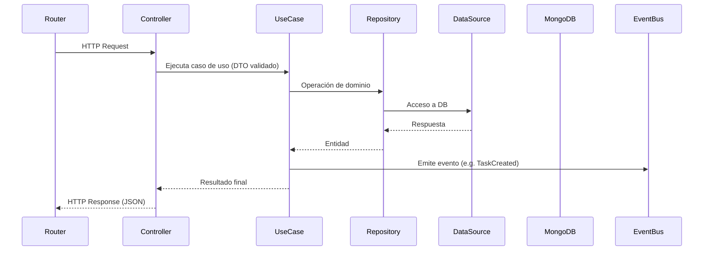

# 🤖 CONTEXT.md — Contexto del Proyecto: Quantum Projects

## 🧩 Descripción general

**Quantum Projects** es una plataforma de **gestión de proyectos con enfoque social-colaborativo**, desarrollada bajo la marca **Quantum MD**.

Su propósito es combinar productividad, colaboración y visibilidad profesional en un mismo entorno, integrando características de **ClickUp**, **Notion** y **Behance**.

En su **fase inicial (MVP)** funcionará como herramienta interna para la gestión de productos y proyectos de **Quantum MD**, y posteriormente evolucionará hacia un **SaaS escalable** con enfoque en equipos, agencias y freelancers.

---

## 🎯 Objetivos principales

- Centralizar la **planificación, organización y seguimiento de proyectos** de desarrollo.
- Fomentar la **colaboración entre equipos** y miembros técnicos.
- Implementar un **núcleo modular** capaz de escalar a microservicios.
- Servir como **base tecnológica** para el ecosistema Quantum MD (Quantum POS, Quantum CRM, Tlaqui, etc.).
- Establecer una **identidad de producto profesional** para futuros clientes y colaboradores.

---

## 🧱 Arquitectura general

El backend sigue los principios de **Clean Architecture**, **DDD (Domain-Driven Design)** y **modular monolith**, asegurando independencia entre las capas y mantenibilidad a largo plazo.

### Capas principales

| Capa                        | Rol                                                    | Ejemplo                                     |
| --------------------------- | ------------------------------------------------------ | ------------------------------------------- |
| **Presentation**            | Controladores y rutas que exponen endpoints HTTP       | `/api/projects`, `/api/users`               |
| **Application (Use Cases)** | Lógica de negocio y orquestación de flujos             | `CreateProjectUseCase`, `AssignTaskUseCase` |
| **Domain**                  | Entidades, interfaces, DTOs, eventos de dominio        | `UserEntity`, `TaskCreatedEvent`            |
| **Infrastructure**          | Repositorios, data sources, servicios externos, logger | `MongoProjectDataSource`, `WinstonLogger`   |

El principio base es que **las dependencias siempre apuntan hacia el dominio**, nunca al revés.

---

## 🧩 Módulos actuales (MVP)

### 1. Identity & Access

- **Responsabilidad:** autenticación, registro y control de acceso.
- **Entidades:** `User`, `Session`, `Role`.
- **Servicios:** JWT, bcrypt, validación de scopes.

### 2. Teams

- **Responsabilidad:** organización de usuarios y gestión de permisos.
- **Entidades:** `Team`, `TeamMember`.
- **Casos de uso:** crear equipo, invitar miembros, cambiar roles.

### 3. Projects

- **Responsabilidad:** creación y control de proyectos.
- **Entidades:** `Project`, `Task`.
- **Casos de uso:** crear proyecto, asignar tareas, cambiar estado.

### 4. Notifications

- **Responsabilidad:** manejar eventos del sistema y avisos a usuarios.
- **Entidades:** `Notification`.
- **Servicios:** sistema interno + worker asíncrono (BullMQ).

---

## ⚙️ Stack técnico

| Componente                 | Tecnología / Herramienta            |
| -------------------------- | ----------------------------------- |
| **Lenguaje**               | TypeScript                          |
| **Backend**                | Node.js + Express                   |
| **ODM**                    | Mongoose (MongoDB)                  |
| **Colas / Jobs**           | BullMQ + Redis                      |
| **Logger**                 | Winston + Loki + Grafana            |
| **Email / Notificaciones** | Nodemailer + eventos                |
| **Infraestructura**        | Docker + Nginx + VPS (DigitalOcean) |
| **Documentación**          | Markdown + Mermaid (diagramas)      |
| **Gestión de código**      | GitHub + Conventional Commits       |

---

## 🔁 Flujo general de una request

